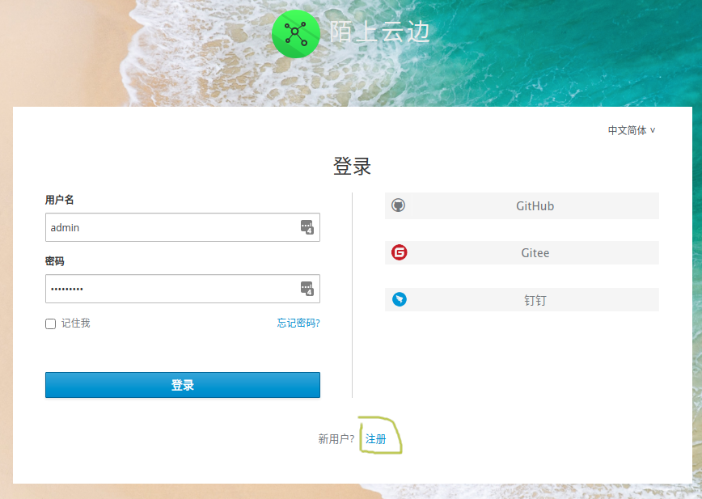
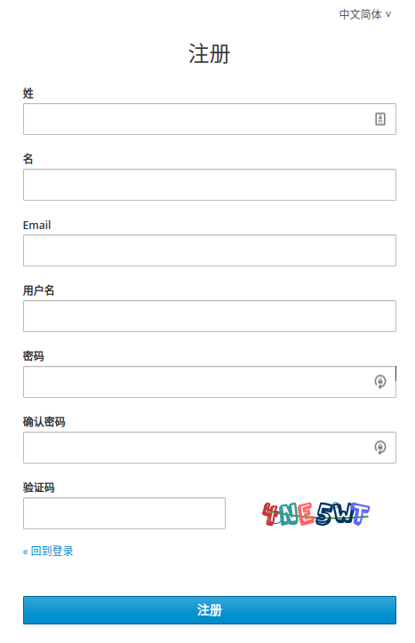
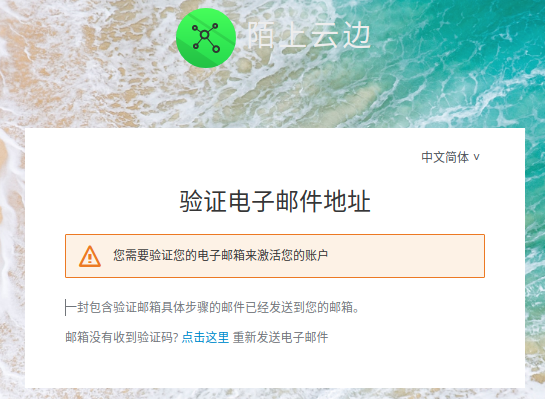
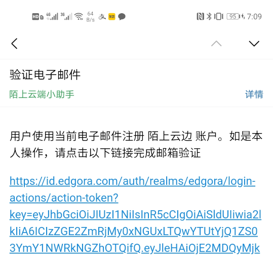
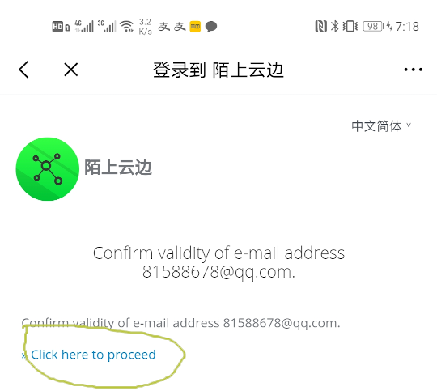

# 帐号注册与登录

* 使用PC或者手机浏览器，打开[控制台](https://console.edgora.com/#/),点击登录按钮

 

* 在登录界面输入帐号密码即可登录， 推荐使用github或者gitee 进行第三方认证登录，可在登录后直接完成注册

* 如没有第三方帐号，需要手动注册，点击上图中注册按钮，进入如下注册界面

* 填写完整注册信息， 并提交注册
 
 1. 用户名必须由字母开头只能包含字母数字以及下划线位数在3-10位之间

 2. 邮件需要验证，注意填写自己的真实邮箱

 3. 验证码如果看不清，点击验证码即可刷新

 

* 登录邮箱，点击验证链接，完成验证

* 完成之后，重新进入[控制台](https://console.edgora.com/#/),点击登录按钮完成登录