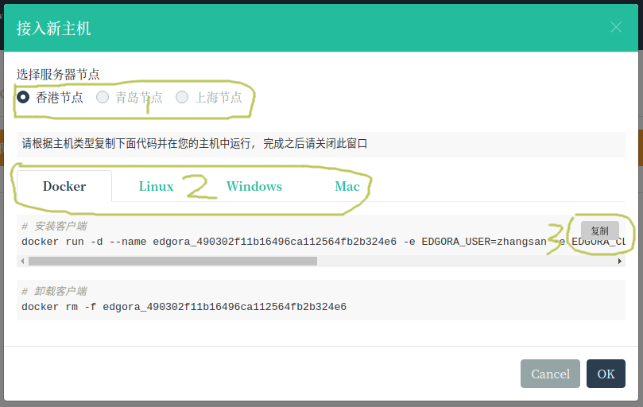

# 在线服务代理

## 主要特性

服务基于[frp](https://github.com/fatedier/frp)， 主要解决了一下几个问题:

* 🔐 提高安全性，对外统一提供安全的https服务

* 🌐 使用可定制的二级域名地址，便于记忆和维护

* 🎖️ 集成统一认证，既保证安全同时保证服务可以分享

* 🚀 采用agent + 云端控制，一次安装即可随时随地多终端控制和使用服务

## 添加主机

* 点击导航栏[服务](https://console.edgora.com/#/service)菜单， 点击 按钮`接入新主机`


* 选择添加主机类型，生成agent 安装命令

 1. 选择离你比较近的服务节点， 由于资源有限,部分节点请[👨‍💻加群👩‍💻](/join-us)获取vip资格

 2. 选择你的服务器类型， 如果是linux server 推荐使用docker方式

 3. 复制命令并在您的主机上执行，完成agent安装



* 在您的主机上执行刚刚复制的命令

```bash
# 安装客户端
docker run -d --name edgora_[你的agent编号] -e EDGORA_USER=[你的帐号] -e EDGORA_CLIENT=[你的agent编号] -e EDGORA_CODE=[验证码] --restart=always edgora/agent
# 查看agent 日志
docker logs -f edgora_[你的agent编号]
```

* 在控制台点击`OK`按钮， 正常情况控制台会出现新添加的主机


* 点击上图中的`编辑`图标，设置备用名字


* 给主机添加备注名字，点击`OK`保存

## 添加服务

为方便远在线管理主机，agent 安装时自带了[ttyd](https://github.com/tsl0922/ttyd) 或者 [gotty](https://github.com/yudai/gotty), ttyd服务端口为30208，下面我们通过web来访问ttyd服务

* 点击`➕`，打开添加服务窗口


* 输入服务信息， 点击`OK` 完成添加

 1. 名称：服务的名字，用于区分服务

 2. 代理类型：如果后端服务使用了https，则填写https否则填写http

 3. 内网地址：想对于agent的内网地址，注意docker类型的127.0.0.1 并非docker host的127.0.0.1

 4. 访问权限: 默认为仅当前登录人可以访问， 如果为所有人可见， 则所有登录本站的用户都可以通过服务地址访问， 令牌访问 则需要在header中添加令牌,一般用于开发调试或者程序访问

 5. 自定义域名: [👨‍💻加群👩‍💻](/join-us)获取vip资格


* 点击服务链接即可访问远程主机上的服务


* 🎉🎉恭喜，你已经可以安全的访问远程主机上的终端了，继续添加你要访问的服务吧✨✨

