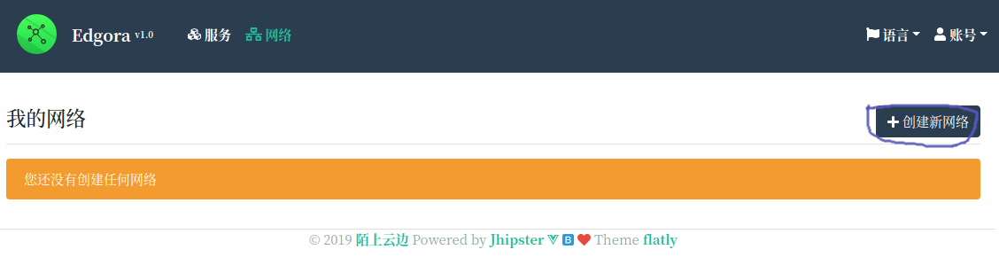
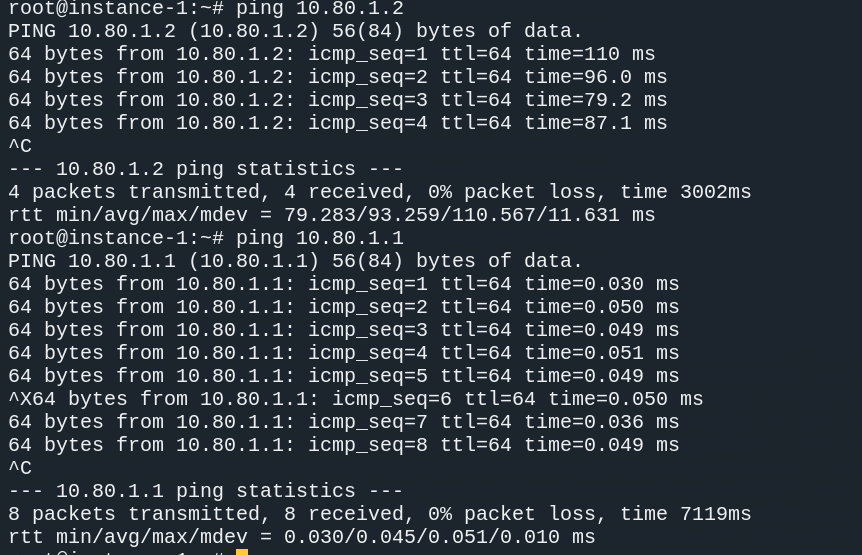

# 虚拟网络

## 主要特性

服务基于[n2n](https://github.com/ntop/n2n)，集成了redis以及token验证，代码已[开源](https://github.com/EdgoraCN/n2n):

* ✨ 点对点组建虚拟局域网，灵活高效

* 🔐 集成身份认证，安全可靠

* 🌐 跨帐号组网， 方便远程团队协作

* 🚀 极简客户端， 内存占用仅1M

* 🥳 无需任何设置，一键入网

## 添加虚拟网络

* 点击导航栏[服务](https://console.edgora.com/#/network)菜单， 点击 按钮`创建新网络`



* 填写虚拟网络信息

 1. 选择离你比较近的服务节点， 由于资源有限,部分节点请[👨‍💻加群👩‍💻](/join-us)获取vip资格

 2. 为您的服务命名，方便管理多个虚拟网络


* 🎉🎉 创建完成，获得一个自动分配的网段，之后添加的节点都将处在这个网段中了


## 添加节点

在有了虚拟网络之后，我们就可以往里面添加节点了

* 点击`添加节点`，打开添加节点窗口


* 输入节点名称， 点击`OK` 完成添加


* 完成之后，我们新创建的节点就出现在列表中，同时获得了一个虚拟ip地址


* 接下来就要将这个虚拟ip绑定到您的主机上，点击上图中的`链接`图标，打开`连接到网络`的窗口

 1. 点击`生成脚本`

 2. 选择你的服务器类型， 如果是linux server 推荐使用docker方式， windows 和 mac 以及 arm 暂不支持

 3. 复制命令并在您的主机上执行，完成虚拟网络绑定


* 在您的服务器或者pc上执行复制的命令

```bash
# 安装客户端
docker run -d --name [容器名字] --restart=always --cap-add=NET_ADMIN --device=/dev/net/tun --net=host edgora/edge:2.6.1 register -u zhangsan -i [客户端id] -p [验证码]
# 成功之后，使用在本机ping虚拟ip
ping [虚拟ip]
```

* 稍后回到控制台，可以看到虚拟节点已经处于`在线`状态


* 仿照以上步骤再添加一个虚拟节点，并虚拟ip绑定到另一台服务器或者pc上


* 两个虚拟机器都处于在线状态了，下面相互ping一下



* 🎉🎉恭喜，你已经将组建了一个虚拟网络, 尽情玩耍吧✨✨
